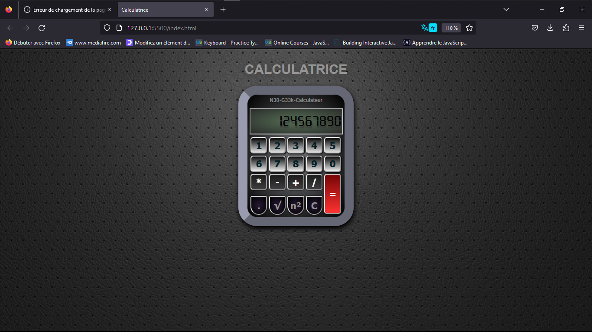

# g33k_virtual_calc
** Version: 0.02 **
### Description:
Ceci est une calculatrice virtual créer en HHTML CSS JS pour un projet de débutant en javascript.
___
### comment améliorer du code js?
veuillez tout simple cloner ce répository, faire des modifications et comiter dans les nouvelles branch
la branche appeler [code_review]

### Exemple de l'app
;
____
@Othor : N30-geek | Email: dryikobu967@protonmail.com

